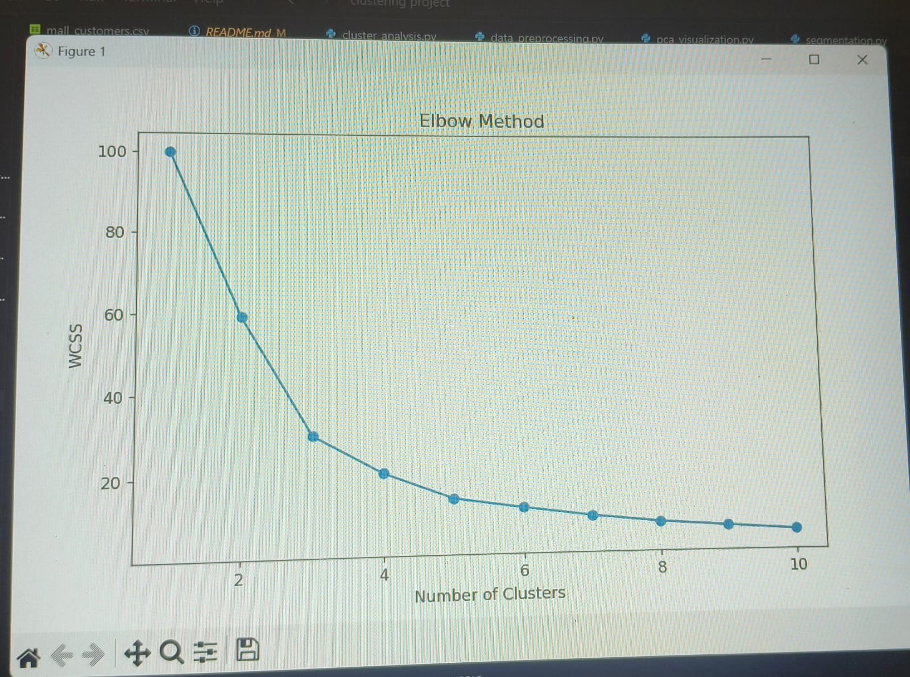
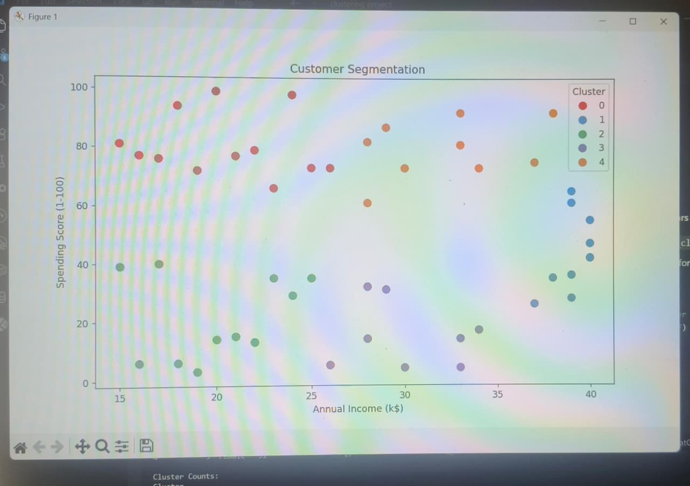

# Customer Segmentation Using K-Means Clustering

## Overview
This project performs customer segmentation using the Mall Customers dataset.

## Features
- Data preprocessing
- Elbow Method for optimal clusters
- K-Means Clustering
- PCA-based Cluster Visualization

## Installation

```bash
pip install -r requirements.txt
```

## Run

```bash
python main.py
```

## Dataset
Mall Customers Dataset

## Output

### Elbow Method



### Customer Segments



## Technologies Used

- Python
- Pandas
- NumPy
- Scikit-Learn
- Matplotlib

## Author

Sudheer